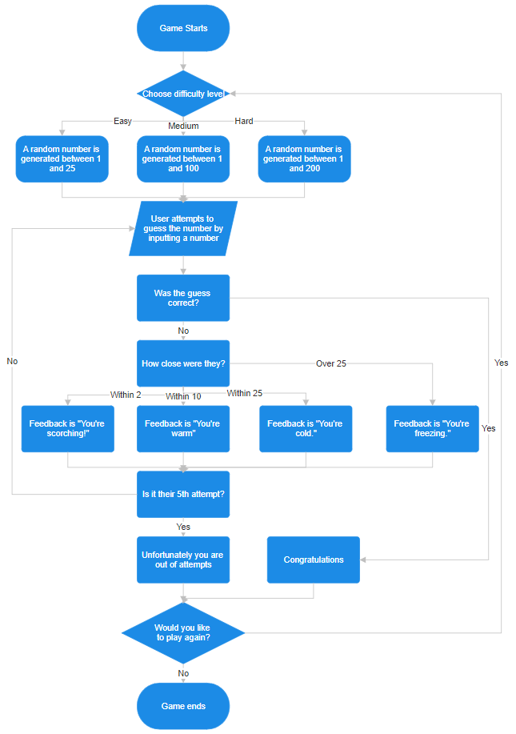
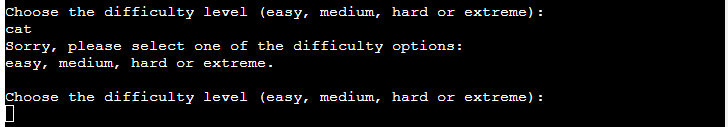
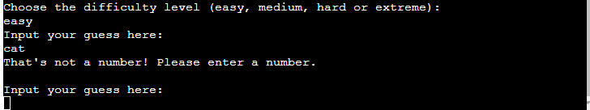
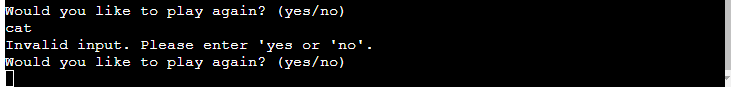

# Higher or Lower
Higher or lower is a Python terminal game, which runs in the Code Institute mock terminal on Heroku.

The user has five attempts to correctly guess the number the game has randomly selected. The game is for fun, for people of all ages and can be as challenging as the user would like it to be. If the user is looking for a straightforward relaxing game they can choose the "easy" difficulty or if they want something very challenging they can select the "extreme" difficulty. The different levels should allow the game to appeal to a wider audience. 

[Live version of the game](https://higher-or-lower131-f3d3fa4260b3.herokuapp.com/)

## Game logic
The below flow chart shows the game logic as the user progresses.

## Features
The game begins with an introduction that explains what the user needs to do and describes the different difficulty levels. The user then chooses between easy, medium, hard and exteme difficulty levels. As the difficulty level increases, the range from which the game randomly selects a number becomes wider. 

Once a difficulty has been selected, a number is randomly generated, and the terminal asks the user to input their first guess. The ranges for each difficulty level are as follows:

 - Easy: 1 to 25
 - Medium: 1 to 100
 - Hard: 1 to 200
 - Extreme: 1 to 1000

After each guess, the user receives feedback, indicating how many attempts they have left, whether they need to guess a higher or lower number, and a temperature system to hint how close they are to the correct answer. The feedback messages are:

 - "You're scorching!" if within 2 of the correct answer.
 - "You're warm." if within 10.
 - "You're cold." if within 25.
 - "You're freezing." if over 25 away.

Whether they are successful in guessing the correct answer or they run out of attempts the user is then asked if they would like to play another game.

If they wish to play another game, the user will then be taken back to the start of the game. If they choose "no" then there will be a message to say "Thank you for playing" and the game will end.

## Testing
I have tested this project in the following ways:

### PEP8 linter
 - I copied all the code in the run.py file
 - Opened the [PEP8 linter](https://pep8ci.herokuapp.com/) website and pasted in my code
 - The feedback came back positive with no errors found.

### Manual testing
Where the user needs to input data I have tested the input in the following ways:
 - Response all in capitals.
 - All in lowercase.
 - Numbers where letters were required and letters where numbers were required.
 - A combination of numbers and letters.
 - A space before and after the input.
 - Empty data input

 All possible responses are handled by the code and where necessary they ask the user to input their response in the correct format. The user receives a message if their guess is outside the range. For example if they choose "easy" and then guess a number higher than 25 they receive some feedback asking for another guess within the range without using up one of their attempts.

 

 The below is the response if something other than the difficulty options is entered.

 

 The below is the response if the user inputs some letters rather than a number when making a guess.

 

 The below is the reponse if anything other than yes or no is entered when asked about playing another game.

 

 ## Deployment
 This project has been deployed on the Code Institute's mock terminal for Heroku.

 Steps taken for deployment:
  - Create a new app in Heroku.
  - Set the buildpacks to .Python and .NodeJS in that order.
  - Link the new app to the repository in GitHub.
  - Deploy the app.

## Credits
- Code Institute for the deployment terminal
 