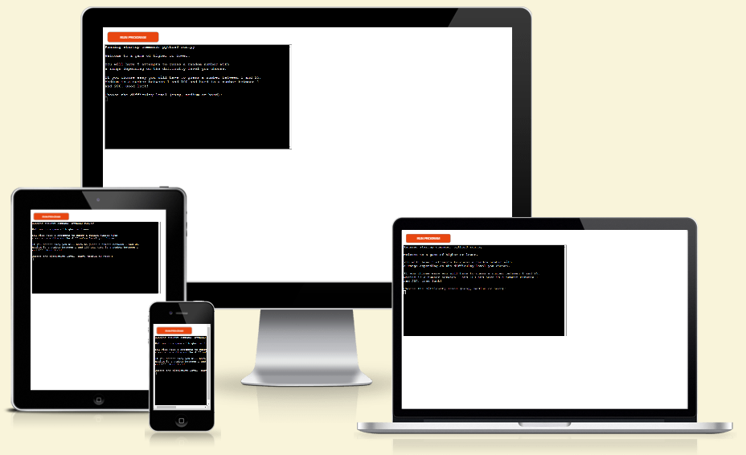
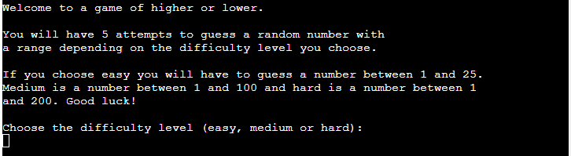
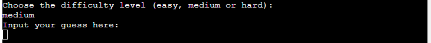
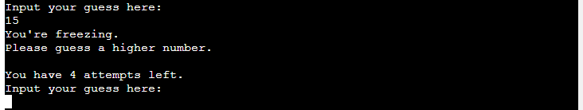
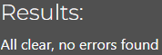
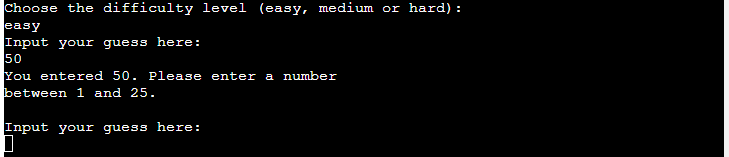

# Higher or Lower
Higher or lower is a Python terminal game, which runs in the Code Institute mock terminal on Heroku.

The user has five attempts to correctly guess the number the game has randomly selected. 

[Live version of the game](https://higher-or-lower131-f3d3fa4260b3.herokuapp.com/)

## Features
The game begins with an introduction that explains what the user needs to do and describes the different difficulty levels. The user then chooses between easy, medium, and hard difficulty levels. As the difficulty level increases, the range from which the game randomly selects a number becomes wider. 

Once a difficulty has been selected a number is randomly generated and the terminal asks the user to input their first guess.

After each guess has been made the user is given feedback, letting them know how many attempts they have left, whether they need to guess a higher or lower number and also a temperature system to give them some idea of how close to the answer they are.

Whether they are successful in guessing the correct answer or they run out of attempts the user is then asked if they would like to play another game.

## Testing
I have tested this project in the following ways:

### PEP8 linter
 - I copied all the code in the run.py file
 - Opened the [PEP8 linter](https://pep8ci.herokuapp.com/) website and pasted in my code
 - The feedback came back positive with no errors found.

### Manual testing
Where the user needs to input data I have tested the input in the following ways:
 - Response all in capitals.
 - All in lowercase.
 - Numbers where letters were required and letters where numbers were required.
 - A combination of numbers and letters.
 - A space before and after the input.

 All possible responses are handled by the code and where necessary they ask the user to input their response in the correct format. The user receives a message if their guess is outside the range. For example if they choose "easy" and then guess a number higher than 25 they receive some feedback asking for another guess. 

 

 ## Deployment
 This project has been deployed on the Code Institute's mock terminal for Heroku.

 Steps taken for deployment:
  - Create a new app in Heroku.
  - Set the buildpacks to .Python and .NodeJS in that order.
  - Link the new app to the repository in GitHub.
  - Deploy the app.

## Credits
- Code Institute for the deployment terminal
 