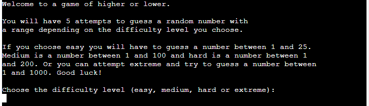
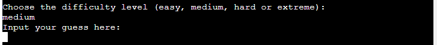

# Higher or Lower
Higher or lower is a Python terminal game, which runs in the Code Institute mock terminal on Heroku.

The user has five attempts to correctly guess the number the game has randomly selected. The game is for fun, for people of all ages and can be as challenging as the user would like it to be. 

[Live version of the game](https://higher-or-lower131-f3d3fa4260b3.herokuapp.com/)

## Flow chart
I designed a flow chart to show the logic as the user progresses through the game.

## Features
The game begins with an introduction that explains what the user needs to do and describes the different difficulty levels. The user then chooses between easy, medium, hard and exteme difficulty levels. As the difficulty level increases, the range from which the game randomly selects a number becomes wider. 

Once a difficulty has been selected a number is randomly generated and the terminal asks the user to input their first guess. Easy is a number between 1 and 25 as it still poses a challenge but with 5 attempts it is definitely doable. Medium is 1 to 100 as that feels like a normal challenge and hard is between 1 and 200 to pose a proper challenge. I then later added in the extreme difficulty of 1 to 1000 for people who are looking for a real challenge. 

After each guess has been made the user is given feedback, letting them know how many attempts they have left, whether they need to guess a higher or lower number and also a temperature system to give them some idea of how close to the answer they are. If the user guesses a number within 2 of the correct they receive the message "You're scorching!" so they know they are very close to the correct answer. The message is "You're warm." if they are within 10 and "You're cold." if they are within 25. If their guess is over 25 then they receive the message "You're freezing.". 

Whether they are successful in guessing the correct answer or they run out of attempts the user is then asked if they would like to play another game.

If they wish to play another game, the user will then be taken back to the start of the game. If they choose "no" then there will be a message to say "Thank you for playing" and the game will end.

## Testing
I have tested this project in the following ways:

### PEP8 linter
 - I copied all the code in the run.py file
 - Opened the [PEP8 linter](https://pep8ci.herokuapp.com/) website and pasted in my code
 - The feedback came back positive with no errors found.

### Manual testing
Where the user needs to input data I have tested the input in the following ways:
 - Response all in capitals.
 - All in lowercase.
 - Numbers where letters were required and letters where numbers were required.
 - A combination of numbers and letters.
 - A space before and after the input.
 - Empty data input

 All possible responses are handled by the code and where necessary they ask the user to input their response in the correct format. The user receives a message if their guess is outside the range. For example if they choose "easy" and then guess a number higher than 25 they receive some feedback asking for another guess within the range.

 

 ## Deployment
 This project has been deployed on the Code Institute's mock terminal for Heroku.

 Steps taken for deployment:
  - Create a new app in Heroku.
  - Set the buildpacks to .Python and .NodeJS in that order.
  - Link the new app to the repository in GitHub.
  - Deploy the app.

## Credits
- Code Institute for the deployment terminal
 